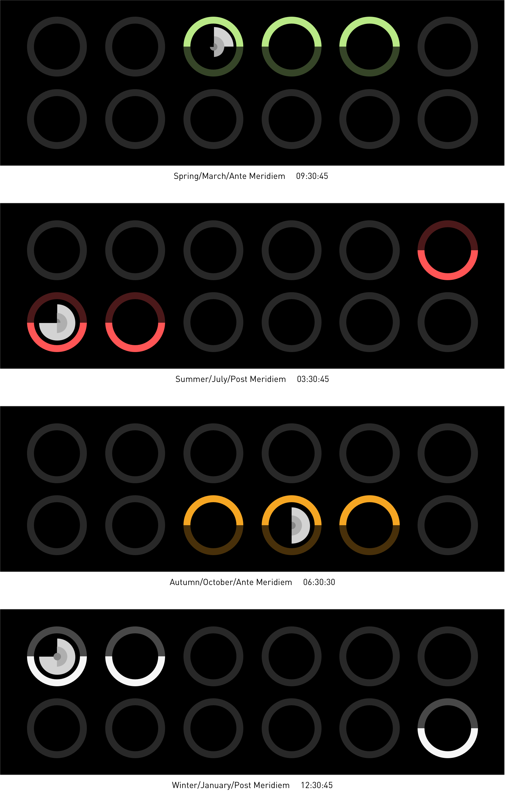

### Right Twice a Day: Hybrid Clock

#### Sketch 01: Season/Month/Meridiem & Hours/Minutes/Seconds

This hybrid time indicator combines the my two previous sketches: the pie clock that displays hours/minutes/seconds and the loop-shape date calendar that displays seasons and months. For more specific information, you could refer to https://github.com/gitacoco/dvia-2019/tree/master/1.mapping-time/process. 

Based on these two designs, I introduce one more variable: Meridiem，which has been mapped into transparency. If it is Ante Meridiem, the upper section of the loop will remain bright while the lower part will be darkened and vice versa.

Regarding this design, I was going to map Daytime and Nighttime in the beginning, but this is a dynamic variable，which means it is hard to quantify，and I could not access such attribute via the clock function. So I finally divided one day into two parts straightforwardly: AM and PM.

Variables used and encoded: 
1)the clock section: Size & Value
4)Meridiem → Transparency
5)Month → Position
6)Season → Color
