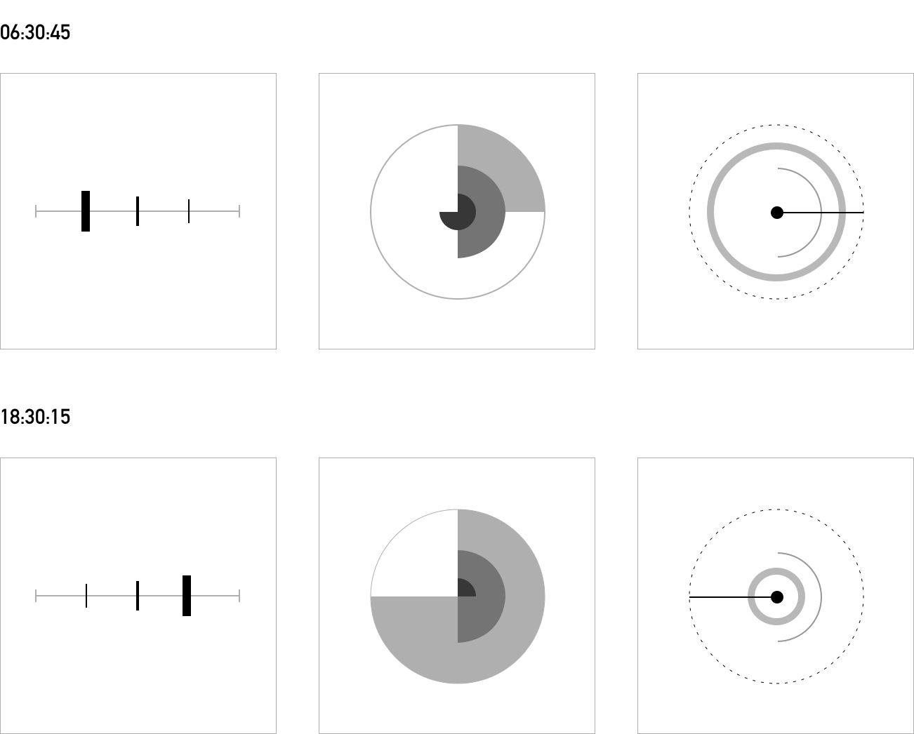
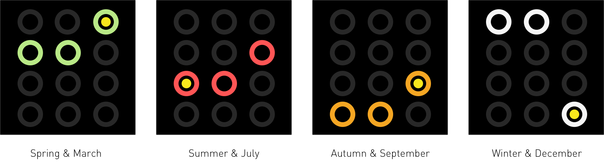
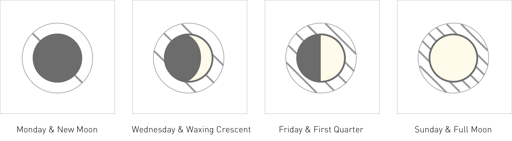
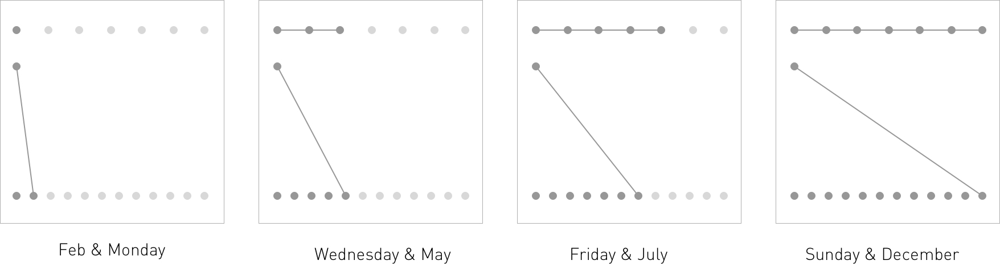
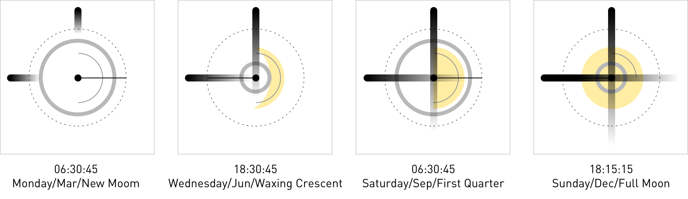

## Process 
### Right Twice a Day: Map Wall-clock Time
> Complete at least three representations of the current wall-clock time (ignore days, weeks, moons, etc. for now) and document your ideas with text and sketches in the process folder. (Week 2 Assignment, 04 Sep 2019)

> This time everything must be done in code. Start by duplicating your project folder three times and naming them clock-1, clock-2, and clock-3. (Week 3 Assignment, 11 Sep 2019)

#### Sketch 01: Bar Clock
##### Variables Used: Position, Size
In this Bar Clock, the three bars that are from thickest to thinnest respectively stand for the hour hands, minute hand and second hand. They move from left to right at their own speed.
See the code [here](https://github.com/gitacoco/dvia-2019/tree/master/1.mapping-time/clock1_BarClock)

#### Sketch 02: Pie Clock
##### Variables Used: Value, Size
The Pie Clock uses three pie charts to visulize elapsed time. These three pie charts are stacked from top to bottom in order from small to large, which respectively represents hour, minute and second.
See the code [here](https://github.com/gitacoco/dvia-2019/tree/master/1.mapping-time/clock2_PieClock)

#### Sketch 02: Line Clock
##### Variables Used: Orientation, Position, Size
The Line Clock uses compound logic. The black indicator is a hour hand that is just like a normal clock, but the dial is applied a 24-hour system. And the incomplete arc represents a minute hand that is growing clockwise and will enter another round after resetting the count every 60 minutes. And the complete thicker loop radiates from the center of the circle to the periphery, which represents the second hand like a live breathing light. The dotted circle is a border of the second hand.
See the code [here](https://github.com/gitacoco/dvia-2019/tree/master/1.mapping-time/clock3_LineClock)

### Right Twice a Day: Map Calendar Time

#### Sketch 01: Season & Month

##### Variables Used of Season: Color, Position
I classify months into four seasons that March to May belong to spring, June to August belong to Summer and so on.
##### Variables Used of Month: Position
Twelve loops are used to present twelve months. These loops could be seen as containers. Each current month would be a point contained in the corresponding loop.

#### Sketch 02: Moon & Day-of-week

##### Variables Used of Moon: Shape
##### Variables Used of Day-of-week: Texture

#### Sketch 03: Month & Day-of-week

##### Variables Used of Month: Orientation, Value
##### Variables Used of Day-of-week: Size, Value

### Right Twice a Day: Hybrid Clock

#### Sketch 01: Season/Month/Meridiem & Hour/Minute/Second
Please refer to the Final folder.

#### Sketch 02: Moon/Month/Weekday & Hour/Minute/Second

#### Sketch 03: Season/Month/Weekday & Hour/Minute/Second

