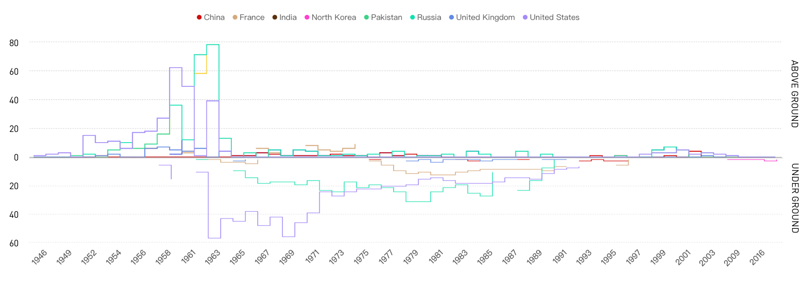
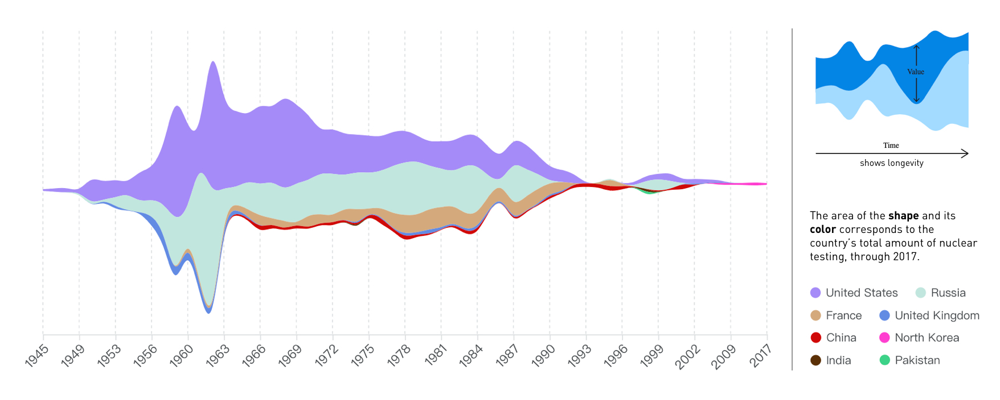

## Process
### A Thousand Suns: Mapping Quantities, Categories, and Summarized Data
#### 01: Chart of Nuclear Testing Illustrating Variables of Year, Country, Testing Frequency and Location

For this chart, lines are plotted to connect the testing active years of each country (the retinal variable: color, shape), whose continuity allows audiences to identify whether there is nuclear testing of a certain year. This is a method to address the 'lull' that resulted from the Comprehensive Test Ban Treaty in ’96 and the more recent resurgence in testing. And the height changes of the line are to map the testing frequency.

#### 02: Chart of Nuclear Testing Illustrating Variables of Year, Country and Testing Frequency

For this chart, I use a Stream Graph to simultaneously show the testing frequency of all countries (the retinal variable: shape) and each country (the retinal variable: color) during the progression of time lapse, reflecting the change of the overall trend while allowing people to identify the proportion of a specific country. In this chart, a audiency could also find it easy to perceive an obvious 'lull' resulted from the Comprehensive Test Ban Treaty in ’96.

#### 02: Chart of Nuclear Testing Illustrating Variables of Year, Country and Testing Frequency

For this chart, I use a Bubble Chart to visulize nuclear testing data and then to compare the testing trend and show the relationships between countries by the use of positioning and proportions. This overall picture reveals the correlation of the background of Cold War.
