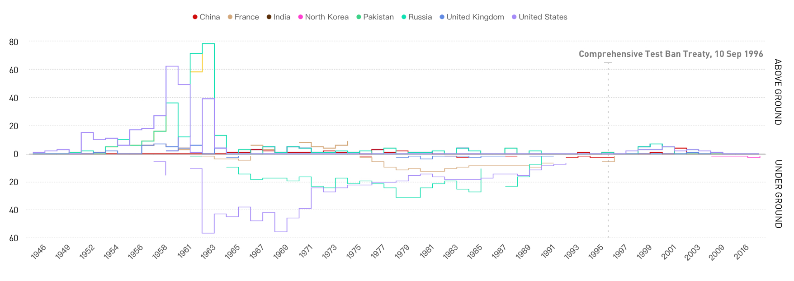
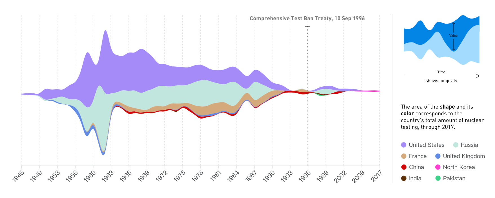
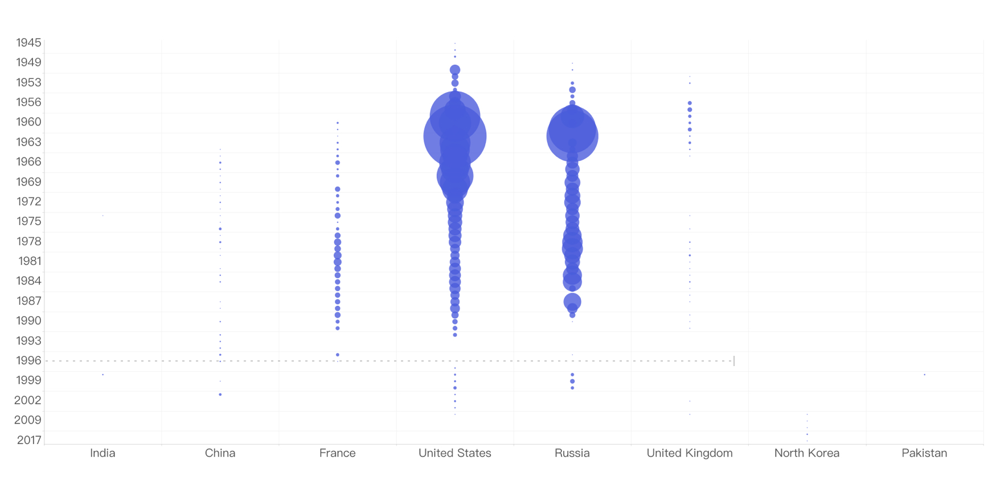
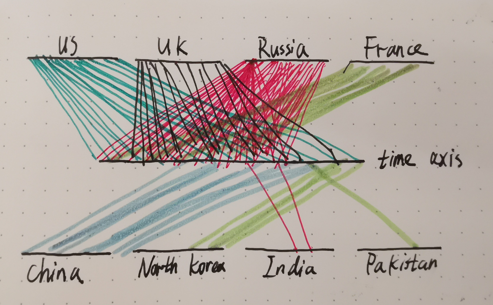
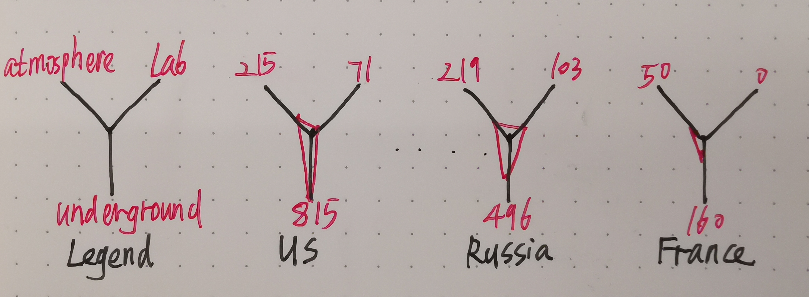
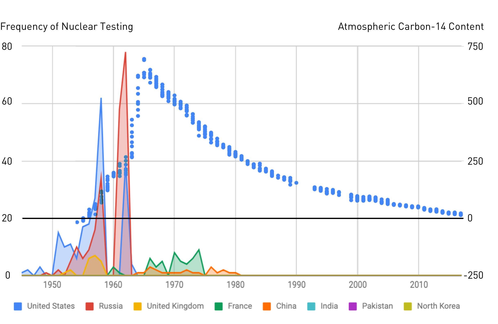
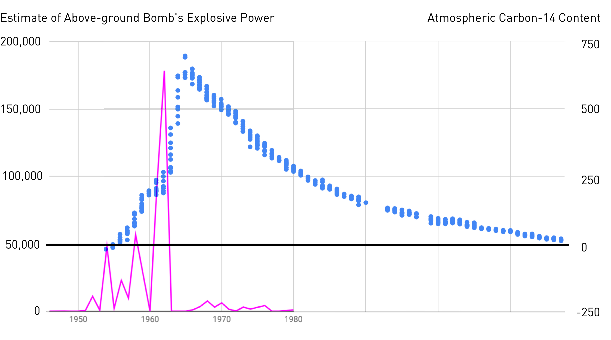
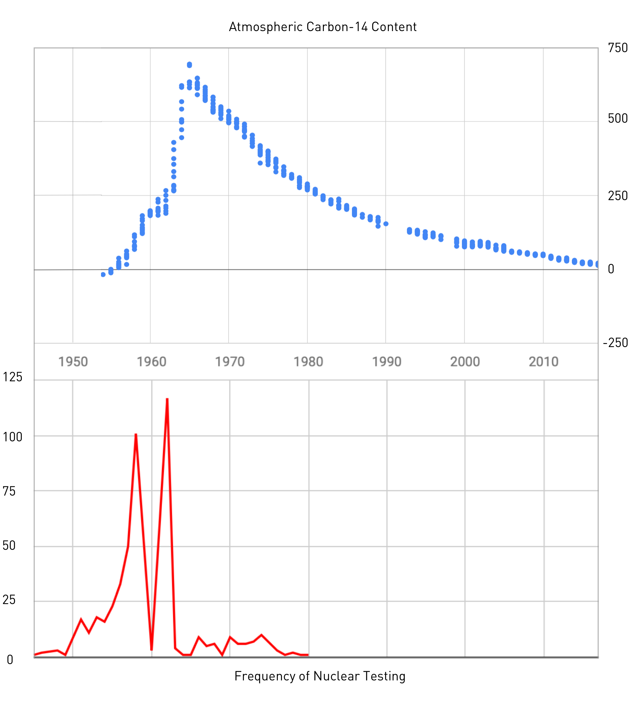
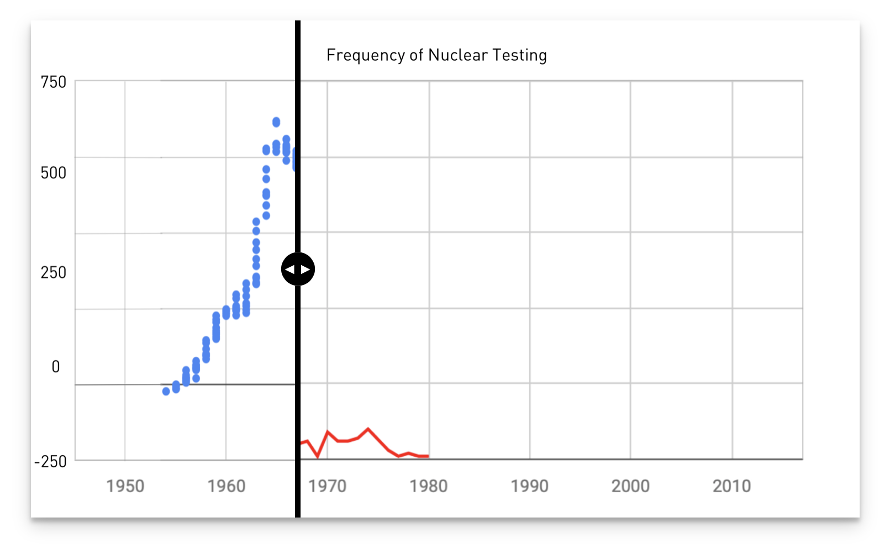
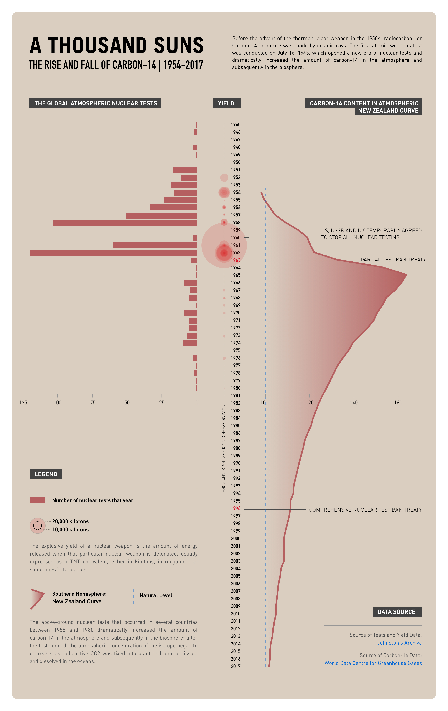

## Process of A Thousand Suns
### 1/ Exploratory Visualizations
> Generate three exploratory visualizations based on the spreadsheet data. In addition, add three pencil sketches to the process folder exploring ways in which you could represent the nuclear testing data without using a map. (Week 6 Assignment, 2 Oct 2019)

#### 01: Chart of Nuclear Testing Illustrating Variables of Year, Country, Testing Frequency and Location

For this chart, lines are plotted to connect the testing active years of each country (the retinal variable: color, shape), whose continuity allows audiences to identify whether there is nuclear testing of a certain year. This is a method to address the 'lull' that resulted from the Comprehensive Test Ban Treaty in ’96 and the more recent resurgence in testing. And the height changes of the line are to map the testing frequency.

This idea was inspired by the Influential Timelines of Joseph Priestley.

#### 02: Chart of Nuclear Testing Illustrating Variables of Year, Country and Testing Frequency

For this chart, I use a Stream Graph to simultaneously show the testing frequency of all countries (the retinal variable: shape) and each country (the retinal variable: color) during the progression of time lapse, reflecting the change of the overall trend while allowing people to identify the proportion of a specific country. In this chart, a audiency could also find it easy to perceive an obvious 'lull' resulted from the Comprehensive Test Ban Treaty in ’96.

#### 02: Chart of Nuclear Testing Illustrating Variables of Year, Country and Testing Frequency

For this chart, I use a Bubble Chart to visulize nuclear testing data and then to compare the testing trend and show the relationships between countries by the use of positioning and proportions. This overall picture reveals the correlation of the background of Cold War.

### 2/Additional Sketch
#### Sketch 1: the Contribution to the Testing Frequency of Each Country and its Evolution

This idea is to use different individual axis to map the timeline in proportion based on the TimeWheel Technique as a variant of Parallel Coordinates.

#### Sketch 2: the Accumulated Testing Frequency of Three Dominant Countries

This idea involves various countries using Star Chart in a small multiple way, showing the accumulated testing frequency of three dominant countries.

### 3/ Prepare the Testing Data
> Clean up whatever spreadsheet manipulation you did to the testing data via pivot tables and the like into a csv-friendly format. (Week 7 Assignment, 16 Oct 2019)

I extracted the [frequency data](https://github.com/gitacoco/dvia-2019/blob/master/2.mapping-quantities/project/data/all-frequency.csv) and the [yield data](https://github.com/gitacoco/dvia-2019/blob/master/2.mapping-quantities/project/data/yieldsbyyear.csv) from the spreadsheet.

### 4/ Introduce External Data
> Find the external data source you’ll be using for your ‘so what’ and ‘compared to what’ variables and convert it to spreadsheet form. (Week 7 Assignment, 16 Oct 2019)

#### External Data: sixty-three years of radiocarbon dioxide measurements at Wellington, New Zealand (1954-2017)
I chose the Carbon-14 data of New Zealand, which is the world’s longest record. I downloaded the data through [World Data Centre for Greenhouse Gases](https://gaw.kishou.go.jp/search) where you could access the dataset. You could also access the [DATASET](https://docs.google.com/spreadsheets/d/e/2PACX-1vR9YwmsYN-sKPuY03hTzqzvdE6TbmHnMo1rUF8z_-T27T_EepPJryzY4S8iEmzLswMhXLGiqJG6Qy_k/pubhtml?gid=574694187&single=true) and the [VARIABLE ATTRIBUTES](https://docs.google.com/spreadsheets/d/e/2PACX-1vR9YwmsYN-sKPuY03hTzqzvdE6TbmHnMo1rUF8z_-T27T_EepPJryzY4S8iEmzLswMhXLGiqJG6Qy_k/pubhtml?gid=910863073&single=true) for this project through my Google Sheets Spreadsheet Form.  

> "Carbon-14 is produced naturally in the atmosphere by a chemical reaction triggered by cosmic rays. Nuclear weapon testing in the 1950s and early 1960s led to a rapid rise in atmospheric levels."  

Vince, G. (2014, June 4). Race to read the H-bomb timestamp that marks all cells. Retrieved October 23, 2019, from https://www.newscientist.com/article/mg22229720-800-race-to-read-the-h-bomb-timestamp-that-marks-all-cells/.

> "Atmospheric Carbon-14, New Zealand[1] and Austria[2]. The New Zealand curve is representative for the Southern Hemisphere, the Austrian curve is representative for the Northern Hemisphere. Atmospheric nuclear weapon tests almost doubled the concentration of 14C in the Northern Hemisphere[3]."  

[1] ["Atmospheric δ14C record from Wellington"](http://cdiac.esd.ornl.gov/trends/co2/welling.html). Trends: A Compendium of Data on Global Change. Carbon Dioxide Information Analysis Center. 1994. 
[2] Levin, I.; et al. (1994). ["δ14C record from Vermunt"](https://cdiac.ess-dive.lbl.gov/trends/co2/cent-verm.html). Trends: A Compendium of Data on Global Change. Carbon Dioxide Information Analysis Center.  
[3] ["Radiocarbon dating"](http://web.science.uu.nl/AMS/Radiocarbon.htm). University of Utrecht.  

### 5/ Merge the External Data and Make hybird Sketches

> Bring in three additional pencil sketches that show different options for merging the testing data with your external data source. (Week 7 Assignment, 16 Oct 2019)

#### Sketch 1: the Relationship Between the Testing Frequency and the Atmospheric 􏰈􏰈Carbon-14 Content

#### Sketch 2: the Relationship Between the Estimate of Above-ground Bomb's Explosive Power and the Atmospheric 􏰈􏰈Carbon-14 Content

### 6/ Code-based Exploration

> Create three code-based sketches exploring your chosen design direction for depicting the testing data and your candidate representations of the external data you’ve collected. (Week 8 Assignment, 23 Oct 2019)

To support a better comparison between two diagrams, I made an updated version based on the sketch of last week. I took apart them into two charts with the **sharing time axis**.

Also, I made a [demo](./jquery-image-stack-compare) to try to realize the picture-stack-compare effect.

### 7/ Final Presentation
> Choose one of your three directions to develop and create a completed version of it. Incorporate at least one additional variable into your representation beyond the original set. (Week 9 Assignment, 30 Oct 2019)

Actually, I only have one direction of exploration, so I have no other choices. The idea of this direction is to compare the carbon-14 content in atmosphere with the global nuclear test frequency, to show the relationship and reveal some insights behind this connection.

I was always thinking that how to make a more natural comparison at the stand points of viewers. I found it still not easy enough to compare this two curve when sharing the time axis, since the contour (peaks and troughs) of these two charts are towards a same direction. So I tried to change to switch the X axis and the Y axis, but still sharing the time axis, then it is much more clear and natural for human perception.

I didn't develop this whole poster through p5.js. I coded [three components separately](https://github.com/gitacoco/dvia-2019/tree/master/2.mapping-quantities/project) and then output them to SVG files, and finally merged and polish them in Sketch App. 

#### the Three Components Generated by p5.js

#### the Final Appearance
