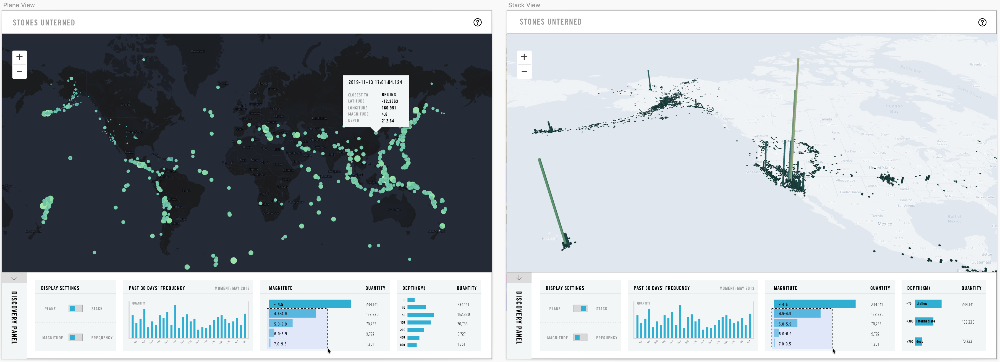
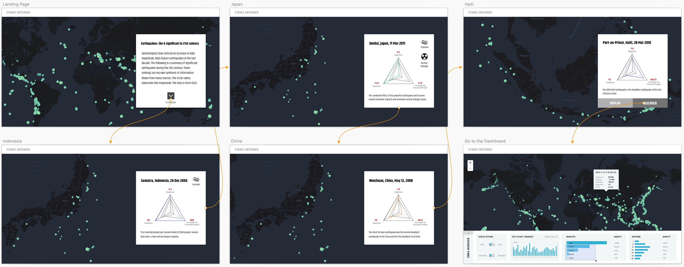

## Process of Stones Unturned

### 1/ Exploratory Visualizations

> Start off by making pencil sketches for your non-spatial ‘diagrammatic’ representation of the data in the feeds. (Week 10 Assignment, 6 Nov 2019)

> On the mapping side of things, figure out what kinds of markers you’ll be adding. (Week 10 Assignment, 6 Nov 2019)

#### Visualize Depth

#### Visualize Manitude

#### Visualize Frequency

### 2/ Prototype

> Explore the selected direction and prototype the different component views that will make up your final visualization with a clear idea of how they will interact with one another. (Week 11 Assignment, 13 Nov 2019)

#### First View: Visualize Frequency

#### Second View: Transform Frequency View

#### Third View: Visualize Depth

#### Interactivity

### 3/ Integrate

> Integrate your diagram and map into a single, cohesive view on one web page. (Week 12 Assignment, 20 Nov 2019) 

> Continue developing your prototype and have a rough draft of your finished project. (Week 13 Assignment, 04 Dec 2019)

#### Simplify Features

#### Amplify Storytelling

### 4/ [Final Presentation](https://github.com/gitacoco/dvia-2019/tree/master/3.mapping-space/final_project)
功能简介：
分别使用点（point） 和六边形（polygon）基于相同的底图（basemap）实现地理信息数据的地图展示；
实现对地理信息数据的统计图表展示，分别选择数据集中相应纬度，实现对“按日期进行频次统计的地震”、“按震级进行频次统计的地震”和“按深度进行频次统计的地震”；
使用控制面板作为交互控件和统计图表的容器；
三个统计图表支持框选功能；

### 5/ Future Work
#### Add more POI on the Map
##### Add Volcanoes
##### Add Fault Lines
#### Cross-encoding of the Color
#### Interactivity of the Charts in the Story Cards
