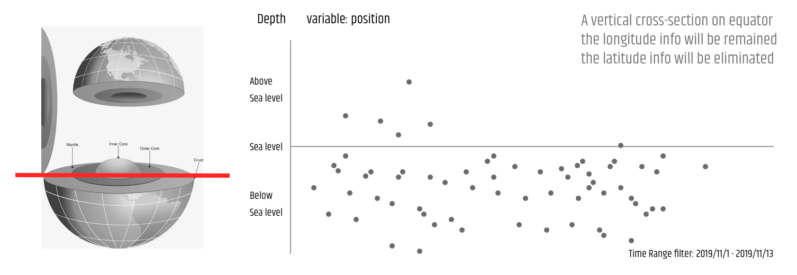
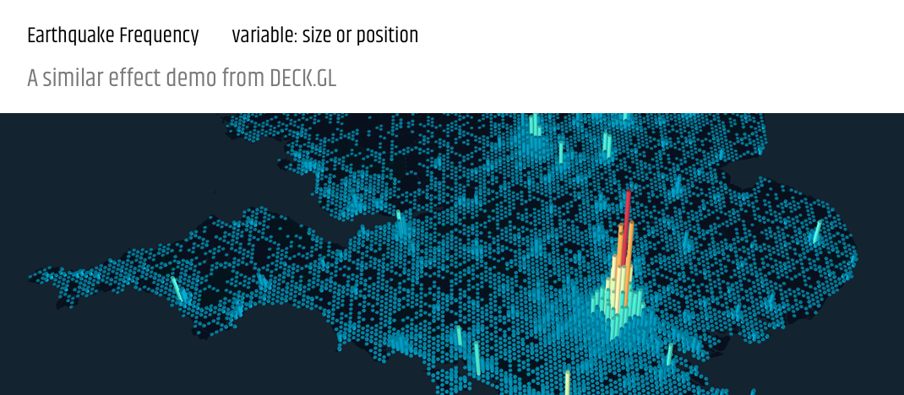
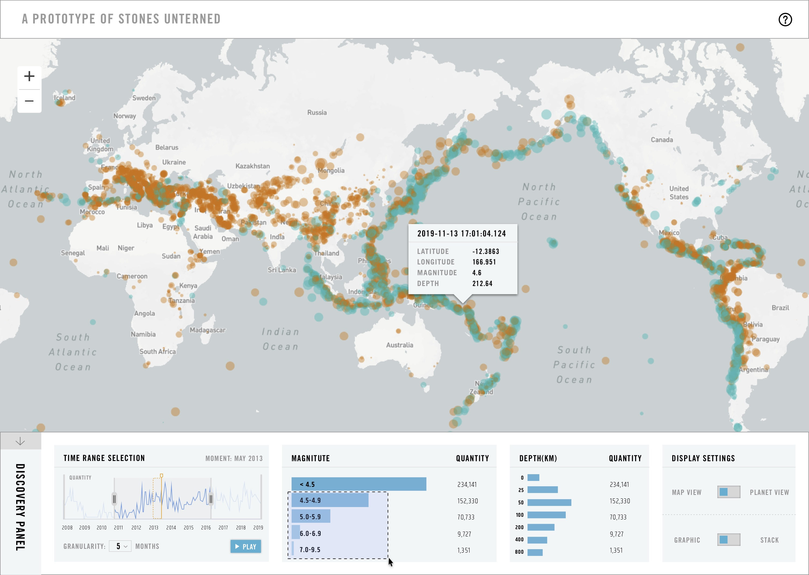
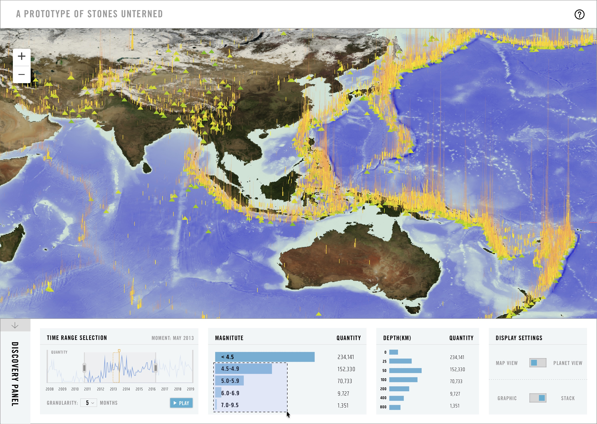
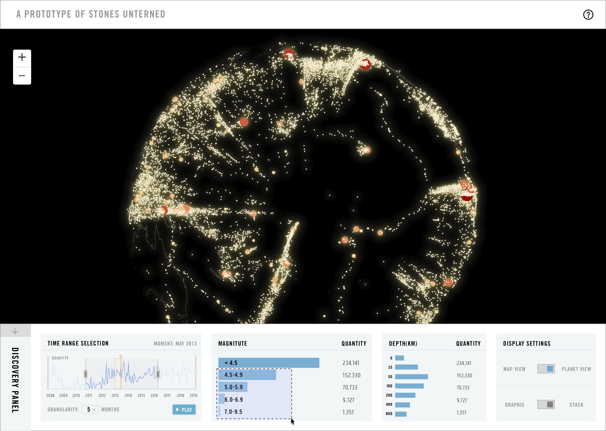

## Process of Stones Unturned

### 1/ Exploratory Visualizations

> Start off by making pencil sketches for your non-spatial ‘diagrammatic’ representation of the data in the feeds. (Week 10 Assignment, 6 Nov 2019)

> On the mapping side of things, figure out what kinds of markers you’ll be adding. (Week 10 Assignment, 6 Nov 2019)

//Describe both the logic of your diagram designs and how they'll relate to the map representation on screen (i.e., is one a sidebar or inset to the other, are the graphics summarizing all earthquakes or do they detail specific ones selected from the map, etc.).

#### Visualize Depth

#### Visualize Manitude

#### Visualize Frequency

### 2/ Prototype

> Explore the selected direction and prototype the different component views that will make up your final visualization with a clear idea of how they will interact with one another. (Week 11 Assignment, 13 Nov 2019)

#### the First View: Visualize Frequency

#### the Second View: Transform Frequency View

#### the Third View: Visualize Depth

#### the Interactivity

### 3/ Integrate

> Integrate your diagram and map into a single, cohesive view on one web page. (Week 12 Assignment, 20 Nov 2019) 

增加故事性

### 4/ Final Presentation

> Continue developing your prototype and have a rough draft of your finished project. (Week 13 Assignment, 04 Dec 2019)

### 5/ Future Work