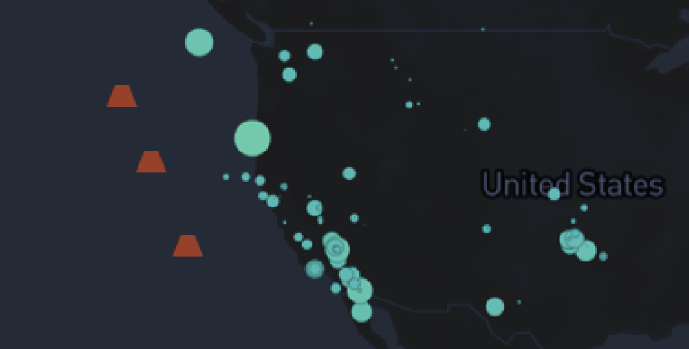
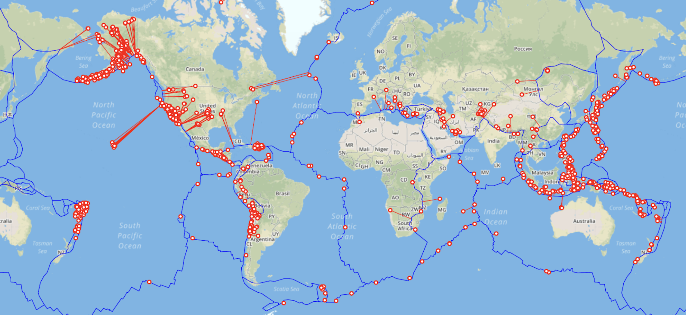

## Process of Stones Unturned

### 1/ Exploratory Visualizations

> Start off by making pencil sketches for your non-spatial ‘diagrammatic’ representation of the data in the feeds. (Week 10 Assignment, 6 Nov 2019)

> On the mapping side of things, figure out what kinds of markers you’ll be adding. (Week 10 Assignment, 6 Nov 2019)

#### 1.1/ Visualize Depth

#### 1.2/ Visualize Manitude

#### 1.3/ Visualize Frequency

### 2/ Prototype

> Explore the selected direction and prototype the different component views that will make up your final visualization with a clear idea of how they will interact with one another. (Week 11 Assignment, 13 Nov 2019)

#### 2.1/ First View: Visualize Frequency

#### 2.2/ Second View: Transform Frequency View

#### 2.3/ Third View: Visualize Depth

#### Interactivity

### 3/ Integrate

> Integrate your diagram and map into a single, cohesive view on one web page. (Week 12 Assignment, 20 Nov 2019) 

> Continue developing your prototype and have a rough draft of your finished project. (Week 13 Assignment, 04 Dec 2019)

#### 3.1/ Simplify Features

#### 3.2/ Amplify Storytelling

### 4/ [Final Presentation](https://github.com/gitacoco/dvia-2019/tree/master/3.mapping-space/final_project)
#### A Brief Introduction
When you visit this site at first you will see a storyting view and then you may enter a dashboard view to discover the map freely.
In the first view, I extract the data of significant earthquakes above the magnitued of 7.0 from USGS to support the story of "the most 4 significant earthquakes in 21st century". And I designed a guidance button to indicate that you could just scroll down to see the next story card. Each card has a corresponding map view (latitude, longitude and zoom level), meaning that when you switch to a certain card, the map view will seamlessly and automatically transform to the exact earthquake occurrence location which you may look into.

### 5/ Future Work
#### 5.1/ Add more POI on the Map
##### 5.1.1/ Add Volcanoes

##### 5.1.2/ Add Fault Lines

#### 5.2/ Cross-encoding of the Color
#### 5.3/ Interactivity of the Charts in the Story Cards
