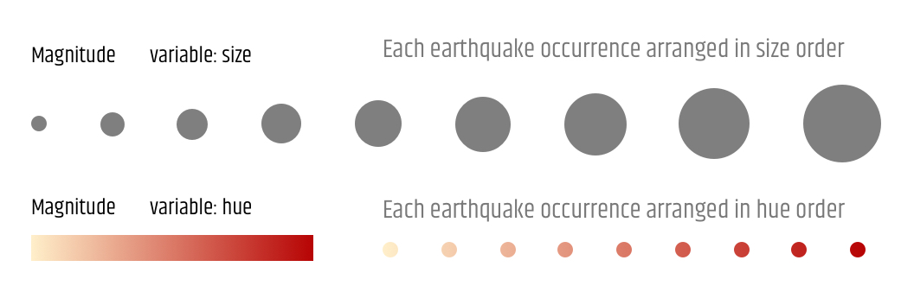
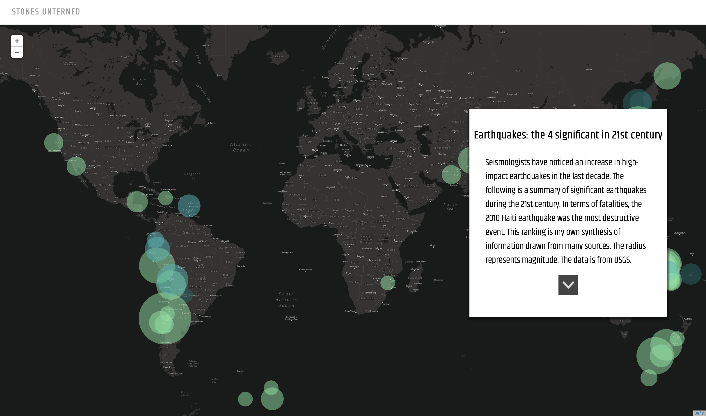
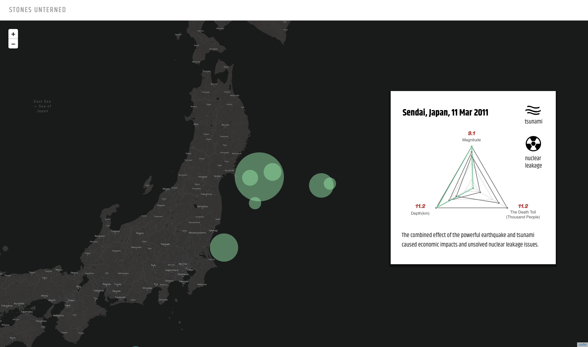

# Process of Stones Unturned

## 1/ Exploratory Visualizations

> Start off by making pencil sketches for your non-spatial ‘diagrammatic’ representation of the data in the feeds. (Week 10 Assignment, 6 Nov 2019)

### 1.1/ Visualize Depth

#### Why this way?
I think it is not intuitive enough to map “depth” though the size, color of points or the height of bars on the map. The color may be suitble for visualizing a few categories of depth. But if we want to see the exact points or the overall pattern, trend and concentration, using aggregate method to only show categories or ranges will eliminate details of the data. Therefore, a three-dimensional map displaying the points at different depth would be a wiser choice. 
#### What's the idea?
The initial idea of this diagram is to show depth information in a two-dimensional way but would reach a similar effect (maybe) as a three-dimensional map. The X axis stands for the longitude coordinate, ranging from −180° to +180° from left to right. The Y axis represents the height range with natural directions: the part above the X axis means above sea level and the below part means below the sea level. Points in this diagram are projected from various latitudes, so latitude information would be eliminated, which is the limitation of this idea, and the reason why Prof. Swinehart thinks this makes no sense.

> On the mapping side of things, figure out what kinds of markers you’ll be adding. (Week 10 Assignment, 6 Nov 2019)

### 1.2/ Visualize Magnitude

### 1.3/ Visualize Frequency

As for magnitude and frequency data, what I want to do is to use a same basemap to display the data in both two-dimensional and three-dimensional ways, and creat seamless transformations to connect different views. Specifically, I plan to use size and/or hue of points to map magnitude data, and use hexagon bars to map frequency data.

## 2/ Case Study and Prototype

> Explore the selected direction and prototype the different component views that will make up your final visualization with a clear idea of how they will interact with one another. (Week 11 Assignment, 13 Nov 2019)

Following my idea and plan, I collected many similar cases and synthesized my prototype.

### 2.1/ First View: Visualize Frequency

source: https://github.com/mapschool/course/issues/38#issuecomment-417553952

### 2.2/ Second View: Transform Frequency View

source: http://www.princeton.edu/~efeibush/earthquakes/

### 2.3/ Third View: Visualize Depth

source: https://glowy-earthquakes.glitch.me/?adumkts=social&aduc=social&adum=external&aduca=social_technical&adusf=linkedin&adut=3d76a431-1519-4725-b169-939f5120340f

### 2.4/ Interactivity

## 3/ Integrate

> Integrate your diagram and map into a single, cohesive view on one web page. (Week 12 Assignment, 20 Nov 2019) 

> Continue developing your prototype and have a rough draft of your finished project. (Week 13 Assignment, 04 Dec 2019)

### 3.1/ Simplify Features

### 3.2/ Amplify Storytelling

## 4/ [Final Presentation](https://github.com/gitacoco/dvia-2019/tree/master/3.mapping-space/final_project)
### A Brief Introduction
When you visit this site at first you will see a storyting view and then you may enter a dashboard view to discover the map freely.

In the first view, I extract the data of significant earthquakes above the magnitued of 7.0 from USGS to support the story of "the most 4 significant earthquakes in 21st century". And I designed a guidance button to indicate that you could just scroll down to see the next story card. 

Each card has a corresponding map view (latitude, longitude and zoom level), meaning that when you switch to a certain card, the map view will seamlessly (Actually, the rendering speed of Leaflet is much much lower than Mapbox, so it's not perfectly seamless.) and automatically transform to the exact earthquake occurrence location which you may look into. And a radar chart has been put in each card, which indicates the relationship among magnitude, depth and the death toll. It's easily to think that an earthquake with a bigger maginitude has a worse consequence, however, this is not always the case. For example, the 311 earthquake happened in Japan (the second card) has a remarkable magnitude, but the radar chart signifies that the people killed by the earthquake are not as much as other same-level earthquakes. So what could we learn from this earthquake?

## 5/ Future Work
### 5.1/ Add more POI on the Map
#### 5.1.1/ Add Volcanoes

Dataset: http://volcano.si.edu/list_volcano_holocene.cfm
#### 5.1.2/ Add Fault Lines

### 5.2/ Cross-encoding of the Color
### 5.3/ Interactivity of the Charts in the Story Cards
